# Looper-Go Architecture

**Looper-Go** is a deterministic, autonomous loop runner for AI agents (Codex, Claude). It processes exactly one task per iteration from a JSON backlog, with fresh context each run, and maintains a JSONL audit log for traceability.

## Table of Contents

1. [High-Level Overview](#high-level-overview)
2. [Core Workflow](#core-workflow)
3. [Project Structure](#project-structure)
4. [CLI Architecture](#cli-architecture)
5. [Configuration System](#configuration-system)
6. [Task Management](#task-management)
7. [Agent System](#agent-system)
8. [Loop Orchestration](#loop-orchestration)
9. [Logging System](#logging-system)
10. [Data Flows](#data-flows)

---

## High-Level Overview

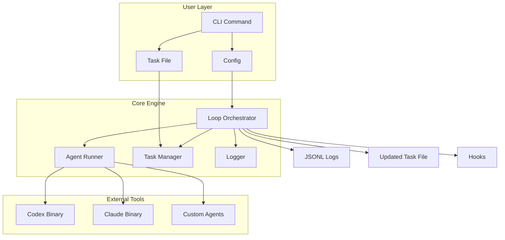

**Core Principles:**
- **Deterministic**: One task per iteration, no ambiguity
- **Autonomous**: Runs until completion or max iterations
- **Traceable**: Full JSONL audit log of all operations
- **Fresh Context**: Each agent run starts with current project state
- **Repairable**: Can recover from invalid states

---

## Core Workflow

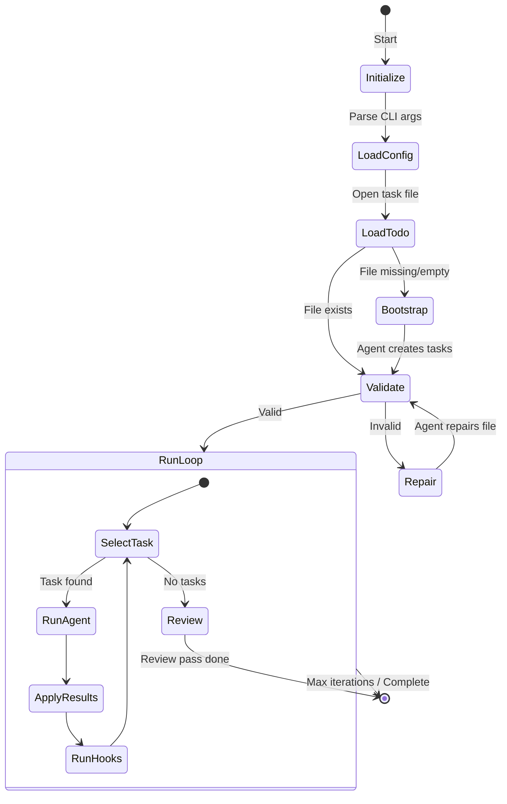

**Workflow Steps:**

1. **Initialize** - Load configuration from hierarchy (defaults → user → project → env → CLI)
2. **Load Todo** - Read and parse the task file (to-do.json)
3. **Bootstrap** - If missing, use agent to create initial task list from project docs
4. **Validate** - Check schema, dependencies, and data integrity
5. **Repair** - If invalid, use agent to fix the task file
6. **Run Loop** - Main iteration cycle:
   - Select next task (doing → todo → blocked priority)
   - Mark as "doing"
   - Run agent with current context
   - Apply results (update status, add new tasks)
   - Execute post-iteration hooks
7. **Review** - When tasks exhausted, run review pass
8. **Complete** - Add completion marker and exit

---

## Project Structure

```
looper-go/
├── cmd/
│   ├── looper/
│   │   └── main.go          # Entry point, signal handling
│   └── root.go              # Command router, flag parsing
│
├── internal/
│   ├── config/              # Configuration loading
│   │   ├── config.go        # Main config structs
│   │   └── loader.go        # Hierarchical loading logic
│   │
│   ├── agents/              # Agent system
│   │   ├── agents.go        # Registry, interfaces, runners
│   │   └── agents_test.go
│   │
│   ├── loop/                # Core orchestration
│   │   ├── loop.go          # Main loop state machine
│   │   ├── select.go        # Task selection algorithm
│   │   └── loop_test.go
│   │
│   ├── todo/                # Task file handling
│   │   ├── todo.go          # Parsing, validation, updates
│   │   ├── schema.go        # JSON schema handling
│   │   └── todo_test.go
│   │
│   ├── prompts/             # Prompt templates
│   │   ├── prompts.go       # Template rendering
│   │   └── schema.go        # Prompt schema validation
│   │
│   ├── logging/             # JSONL logging
│   │   ├── logging.go       # Logger, log writers
│   │   └── tail.go          # Log tailing utility
│   │
│   ├── hooks/               # Post-iteration hooks
│   │   └── hooks.go         # Hook execution
│   │
│   ├── utils/               # Shared utilities
│   │   ├── doc.go
│   │   └── platform.go      # Platform detection
│   │
│   └── ui/                  # Terminal interfaces (optional)
│
├── prompts/                 # Bundled prompt templates
│   ├── bootstrap.md
│   ├── repair.md
│   ├── iteration.md
│   ├── review.md
│   └── push.md
│
├── bin/
│   └── looper.sh            # Legacy shell script (for reference)
│
├── to-do.json               # Task file (runtime)
├── run.schema.json          # Task file schema
├── go.mod
├── go.sum
├── Makefile
└── README.md
```

---

## CLI Architecture

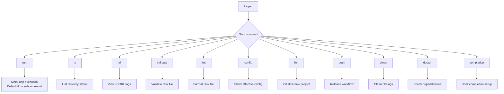

### Command Hierarchy

| Command | Purpose | Key Functions |
|---------|---------|---------------|
| `run` | Execute main loop | `cmd.Run` |
| `ls` | List tasks | `cmd.ListTasks` |
| `tail` | View logs | `cmd.TailLogs` |
| `validate` | Validate task file | `cmd.ValidateFile` |
| `fmt` | Format task file | `cmd.FormatFile` |
| `config` | Show config | `cmd.ShowConfig` |
| `init` | Initialize project | `cmd.InitProject` |
| `push` | Release workflow | `cmd.PushRelease` |
| `clean` | Clean logs | `cmd.CleanLogs` |
| `doctor` | Check dependencies | `cmd.RunDoctor` |

---

## Configuration System

Configuration is loaded hierarchically, with each layer overriding the previous:

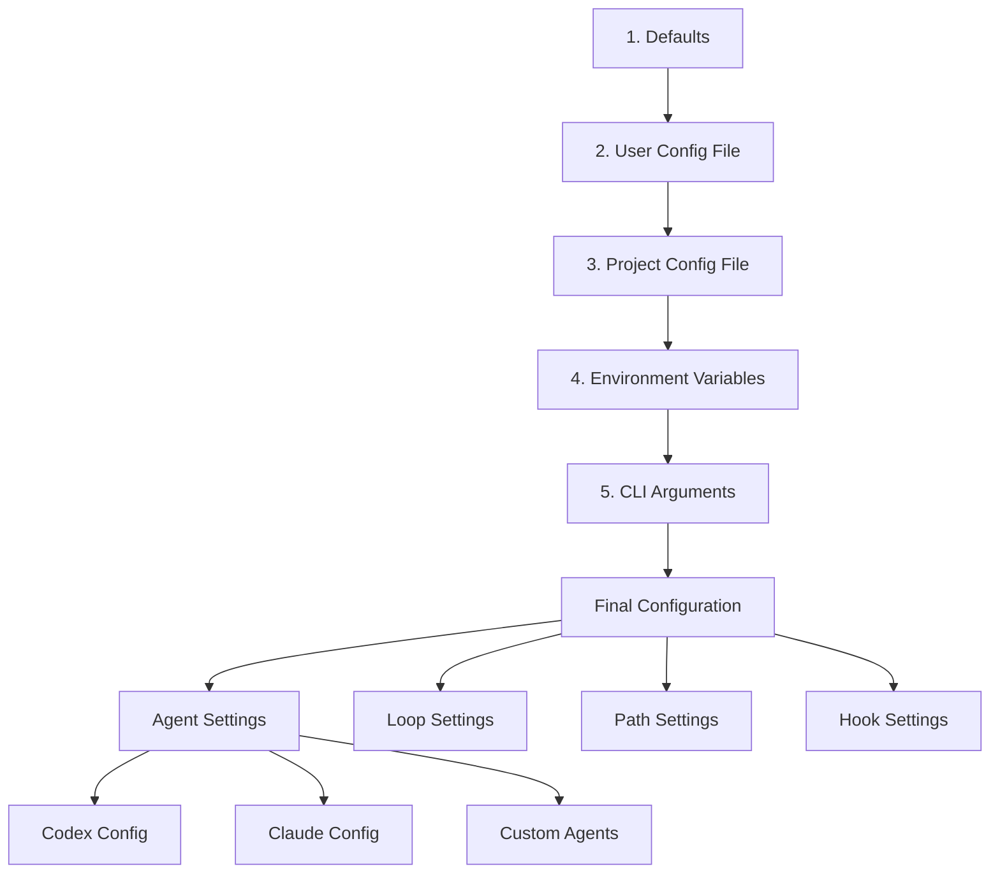

### Configuration Sources

| Priority | Source | Location | Format |
|----------|--------|----------|--------|
| 1 (lowest) | Defaults | Compiled-in | Go structs |
| 2 | User config | `~/.config/looper/config.json` | JSON |
| 3 | Project config | `.looper/config.json` | JSON |
| 4 | Environment | `LOOPER_*` variables | Env vars |
| 5 (highest) | CLI args | Command line | Flags |

### Agent Configuration Structure

```go
type AgentConfig struct {
    Binary    string       // Path to agent binary
    Model     string       // Model name/ID
    Args      []string     // Additional arguments
    Timeout   time.Duration // Execution timeout
    WorkDir   string       // Working directory
    LastMsg   string       // Path to last message file
}
```

### Scheduling Strategies

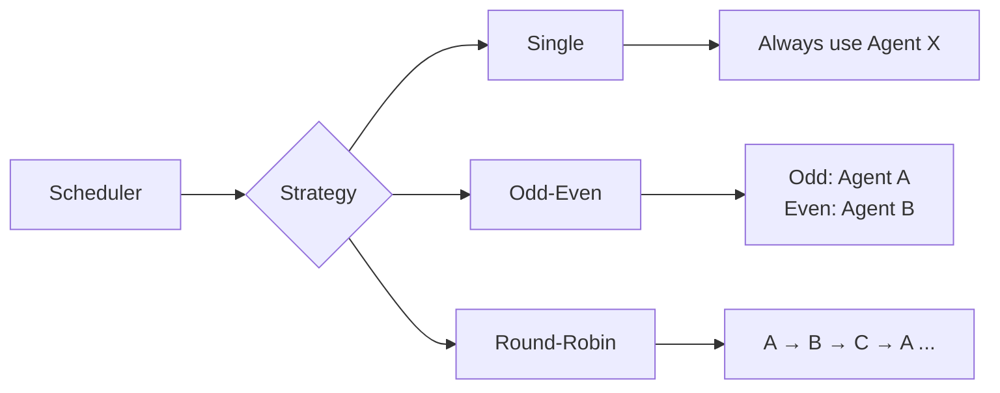

---

## Task Management

### Task File Structure

```json
{
  "schema_version": 1,
  "project": {
    "name": "Project Name",
    "root": "."
  },
  "source_files": ["README.md"],
  "tasks": [
    {
      "id": "T001",
      "title": "Task title",
      "description": "Detailed description",
      "reference": "path/to/relevant/files",
      "priority": 1,
      "status": "todo",
      "details": "Implementation notes",
      "steps": ["Step 1", "Step 2"],
      "blockers": ["Blocking issue description"],
      "tags": ["category", "feature"],
      "files": ["file1.go", "file2.go"],
      "depends_on": ["T002"],
      "created_at": "2024-01-01T00:00:00Z",
      "updated_at": "2024-01-01T00:00:00Z"
    }
  ]
}
```

### Task Status Flow

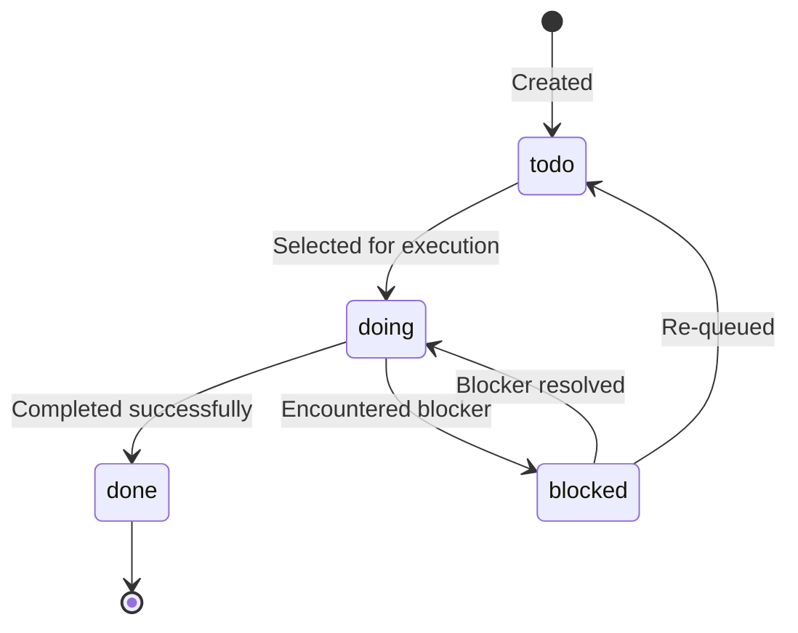

### Task Selection Algorithm

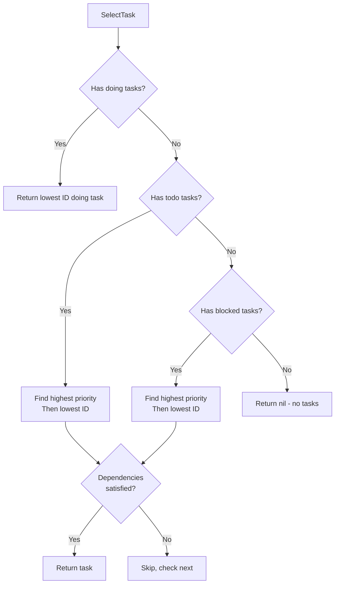

**Priority:**
1. `doing` tasks (lowest ID first)
2. `todo` tasks (highest priority = lowest number, then lowest ID)
3. `blocked` tasks (highest priority = lowest number, then lowest ID)

### Dependency Validation

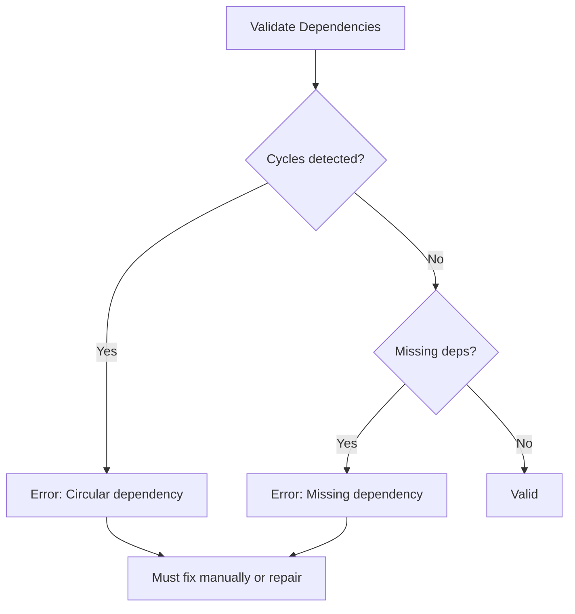

---

## Agent System

### Agent Architecture

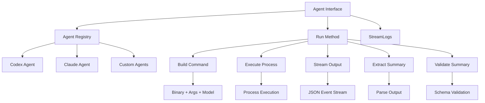

### Agent Registry

The agent system uses a registry pattern:

```go
type Agent interface {
    Run(ctx context.Context, prompt string) (*Summary, error)
}

var registry = map[string]Agent{
    "codex":  &CodexAgent{},
    "claude": &ClaudeAgent{},
}

func RegisterAgent(name string, agent Agent) {
    registry[name] = agent
}
```

### Agent Execution Flow

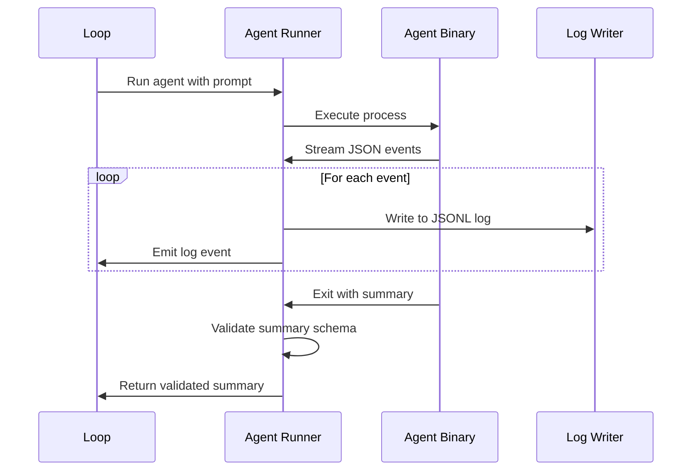

### Log Event Types

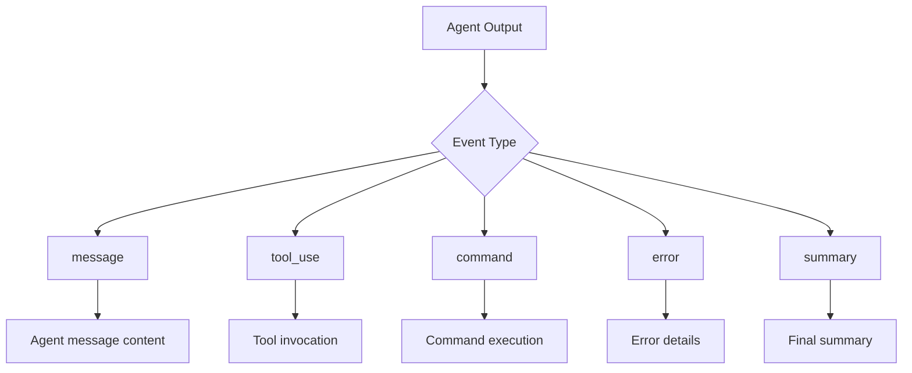

---

## Loop Orchestration

### Loop State Machine

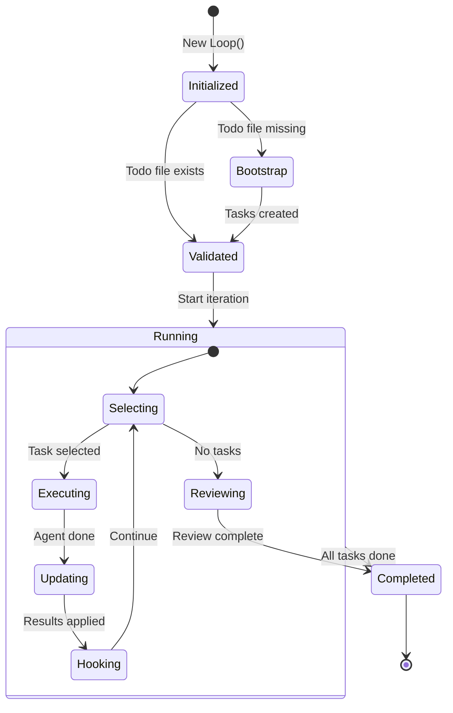

### Iteration Cycle

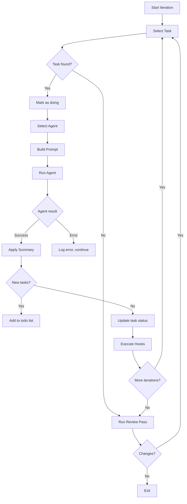

### Prompt Building

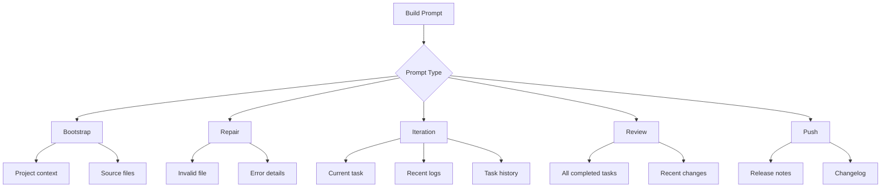

---

## Logging System

### Log Architecture

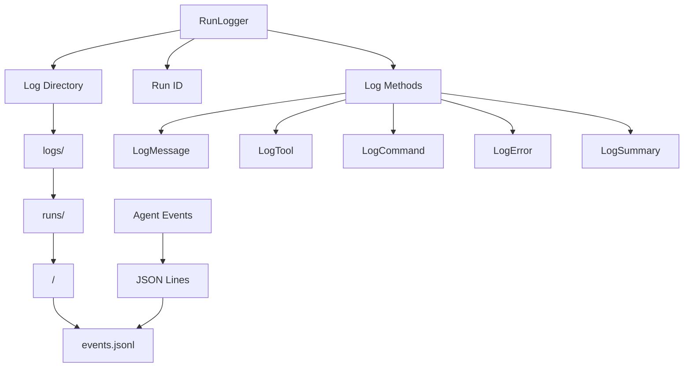

### JSONL Log Format

Each line is a JSON object:

```json
{"type": "message", "timestamp": "2024-01-01T00:00:00Z", "role": "assistant", "content": "..."}
{"type": "tool_use", "timestamp": "2024-01-01T00:00:00Z", "name": "read_file", "input": {"file_path": "..."}}
{"type": "command", "timestamp": "2024-01-01T00:00:00Z", "command": "go build ./cmd/looper"}
{"type": "error", "timestamp": "2024-01-01T00:00:00Z", "error": "Build failed"}
{"type": "summary", "timestamp": "2024-01-01T00:00:00Z", "status": "done", "new_tasks": [...]}
```

### Log Organization

```
looper-logs/
├── runs/
│   ├── 2024-01-01_12-00-00/
│   │   └── events.jsonl
│   ├── 2024-01-01_13-30-45/
│   │   └── events.jsonl
│   └── ...
└── last
    └── -> symlink to latest run
```

---

## Data Flows

### Complete Run Flow

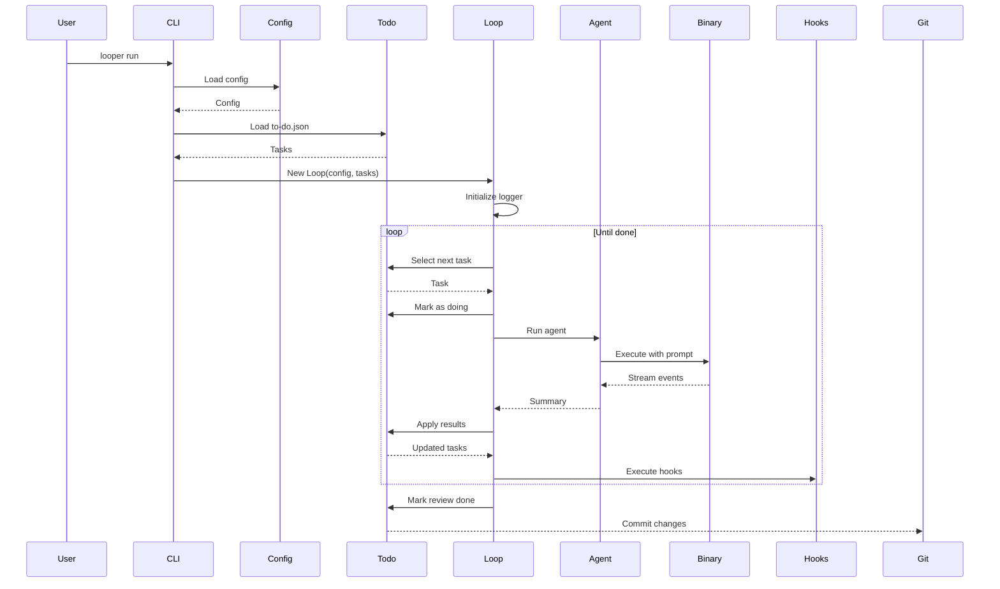

### Configuration Loading Flow

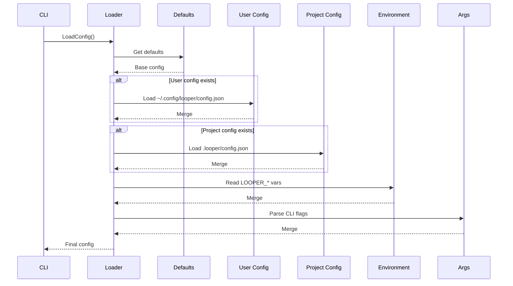

### Task Update Flow

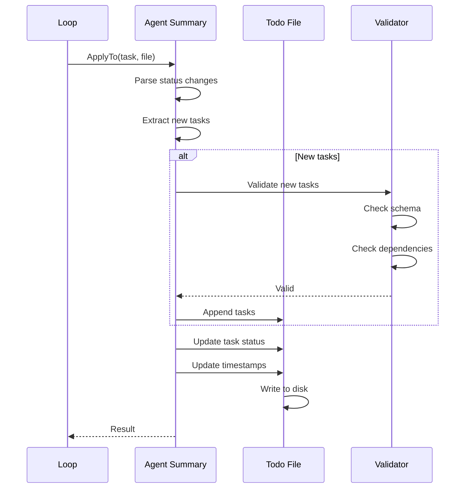

---

## Key Design Decisions

1. **JSONL for Logging**: Line-delimited JSON for easy streaming and parsing
2. **Fresh Context**: Each agent run sees current state, no long-running state
3. **Deterministic Selection**: Clear task ordering, no ambiguity
4. **Repairable**: Can recover from invalid states via agent repair
5. **Auditable**: Full log of all operations for debugging
6. **Extensible**: Agent registry allows adding new agent types
7. **Hierarchical Config**: Flexible configuration from multiple sources

---

## Extension Points

| Component | How to Extend |
|-----------|---------------|
| Agents | Implement `Agent` interface and register |
| Prompts | Add custom templates or use `--prompt-file` |
| Hooks | Add commands to `hooks.post_iteration` array |
| Schedulers | Add new strategy to config loader |
| Log Parsers | Process JSONL files with custom tools |

---

## Performance Considerations

- **Log Size**: JSONL logs grow with each run; use `looper clean` periodically
- **Context Window**: Large todo files may hit agent limits; consider splitting
- **Agent Latency**: Each iteration waits for agent completion; parallel agents not supported
- **File I/O**: Task file written after each iteration; SSD recommended

---

## Security Considerations

- **Command Execution**: Agents can run arbitrary commands; review hooks
- **API Keys**: Stored in config files; ensure proper permissions
- **Working Directory**: Agents run within project root; sandboxed by directory
- **Log Sensitivity**: Logs may contain sensitive data; clean before sharing

---

## Future Enhancements

Potential areas for expansion:

- Parallel agent execution for independent tasks
- Task prioritization heuristics
- Distributed task execution
- Web dashboard for monitoring
- Custom log analyzers
- Task templates and snippets
- Integration with project management tools
