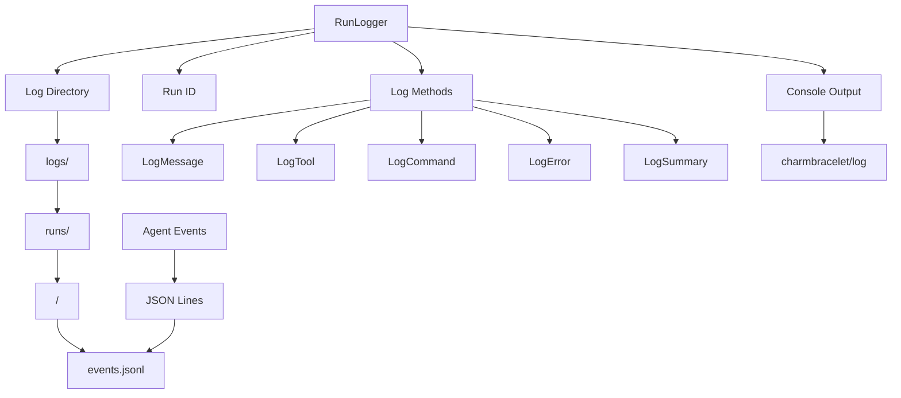
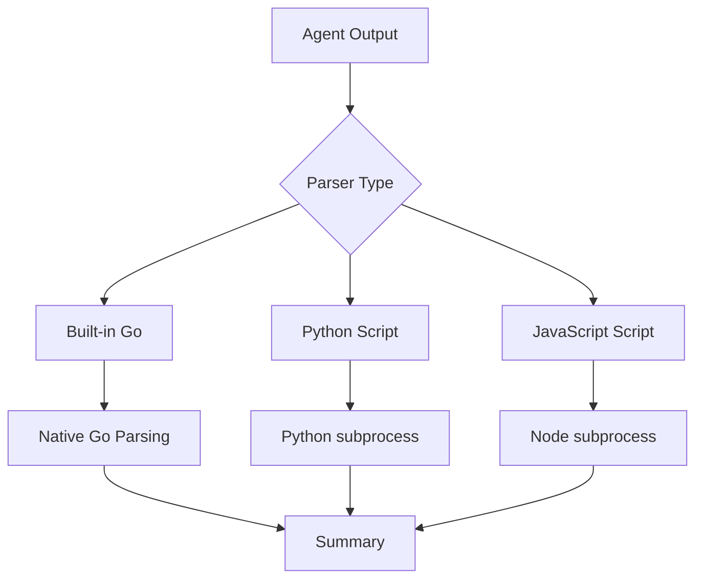

# Looper-Go Architecture

**Looper-Go** is a deterministic, autonomous loop runner for AI agents (Codex, Claude). It processes exactly one task per iteration from a JSON backlog, with fresh context each run, and maintains a JSONL audit log for traceability.

## Table of Contents

1. [High-Level Overview](#high-level-overview)
2. [Core Workflow](#core-workflow)
3. [Project Structure](#project-structure)
4. [CLI Architecture](#cli-architecture)
5. [Configuration System](#configuration-system)
6. [Task Management](#task-management)
7. [Agent System](#agent-system)
8. [Loop Orchestration](#loop-orchestration)
9. [Logging System](#logging-system)
10. [Data Flows](#data-flows)

---

## High-Level Overview


**Core Principles:**
- **Deterministic**: One task per iteration, no ambiguity
- **Autonomous**: Runs until completion or max iterations
- **Traceable**: Full JSONL audit log of all operations
- **Fresh Context**: Each agent run starts with current project state
- **Repairable**: Can recover from invalid states

---

## Core Workflow


**Workflow Steps:**

1. **Initialize** - Load configuration from hierarchy (defaults → user → project → env → CLI)
2. **Load Todo** - Read and parse the task file (to-do.json)
3. **Bootstrap** - If missing, use agent to create initial task list from project docs
4. **Validate** - Check schema, dependencies, and data integrity
5. **Repair** - If invalid, use agent to fix the task file
6. **Run Loop** - Main iteration cycle:
   - Select next task (doing → todo → blocked priority)
   - Mark as "doing"
   - Run agent with current context
   - Apply results (update status, add new tasks)
   - Execute post-iteration hooks
7. **Review** - When tasks exhausted, run review pass
8. **Complete** - Add completion marker and exit

---

## Project Structure

```
looper-go/
├── cmd/
│   ├── looper/
│   │   └── main.go          # Entry point, signal handling
│   └── root.go              # Command router, flag parsing
│
├── internal/
│   ├── agents/              # Agent system
│   │   ├── agents.go        # Core agent implementation
│   │   ├── claude.go        # Claude-specific agent
│   │   ├── codex.go         # Codex-specific agent
│   │   ├── factory.go       # Agent factory pattern
│   │   ├── generic.go       # Generic agent implementation
│   │   ├── log_writer.go    # Log writer implementations
│   │   ├── parsing.go       # Summary parsing logic
│   │   ├── registry.go      # Agent registry
│   │   ├── runner.go        # Agent runner
│   │   ├── streaming.go     # Streaming output handling
│   │   ├── types.go         # Type definitions
│   │   ├── validation.go    # Summary validation
│   │   ├── console_log_writer.go  # Console log writer
│   │   └── agents_test.go
│   │
│   ├── config/              # Configuration loading
│   │   ├── config.go        # Main config structs
│   │   ├── env.go           # Environment variable loading
│   │   ├── flags.go         # CLI flag parsing
│   │   ├── getters.go       # Configuration getters
│   │   ├── load.go          # Configuration loading
│   │   ├── merge.go         # Configuration merging
│   │   ├── paths.go         # Path resolution
│   │   ├── sources.go       # Configuration sources
│   │   ├── types.go         # Type definitions
│   │   ├── dev.go           # Dev mode configuration
│   │   ├── example.go       # Example configuration
│   │   └── config_test.go
│   │
│   ├── loop/                # Core orchestration
│   │   ├── loop.go          # Main loop state machine
│   │   └── loop_test.go
│   │
│   ├── todo/                # Task file handling
│   │   ├── types.go         # Task types and validation
│   │   ├── types_test.go
│   │   └── types_bench_test.go
│   │
│   ├── prompts/             # Prompt templates
│   │   ├── prompts.go       # Template rendering
│   │   ├── prompts_test.go
│   │   └── prompts_bench_test.go
│   │
│   ├── parsers/             # Parser plugin system
│   │   ├── interface.go     # Parser interface and registry
│   │   ├── external.go      # External parser support (Python/JS)
│   │   └── bundled/         # Bundled parsers
│   │       ├── claude_parser.py
│   │       ├── codex_parser.py
│   │       └── opencode_parser.py
│   │
│   ├── logging/             # JSONL logging
│   │   ├── logging.go       # Logger with charmbracelet/log
│   │   └── logging_test.go
│   │
│   ├── hooks/               # Post-iteration hooks
│   │   ├── hooks.go         # Hook execution
│   │   └── hooks_test.go
│   │
│   ├── utils/               # Shared utilities
│   │   ├── common.go        # Common utility functions
│   │   ├── schedule.go      # Schedule-related utilities
│   │   ├── platform.go      # Platform detection
│   │   └── platform_test.go
│   │
│   └── ui/                  # Terminal interfaces (optional)
│       └── tui.go
│
├── prompts/                 # Bundled prompt templates
│   ├── bootstrap.md
│   ├── repair.md
│   ├── iteration.md
│   ├── review.md
│   └── push.md
│
├── to-do.json               # Task file (runtime)
├── to-do.schema.json        # Task file schema
├── go.mod
├── go.sum
├── Makefile
└── README.md
```

---

## CLI Architecture


### Command Hierarchy

| Command | Purpose | Key Functions |
|---------|---------|---------------|
| `run` | Execute main loop | `cmd.Run` |
| `ls` | List tasks | `cmd.ListTasks` |
| `tail` | View logs | `cmd.TailLogs` |
| `validate` | Validate task file | `cmd.ValidateFile` |
| `fmt` | Format task file | `cmd.FormatFile` |
| `config` | Show config | `cmd.ShowConfig` |
| `init` | Initialize project | `cmd.InitProject` |
| `push` | Release workflow | `cmd.PushRelease` |
| `clean` | Clean logs | `cmd.CleanLogs` |
| `doctor` | Check dependencies | `cmd.RunDoctor` |

---

## Configuration System

Configuration is loaded hierarchically, with each layer overriding the previous:


### Configuration Sources

| Priority | Source | Location | Format |
|----------|--------|----------|--------|
| 1 (lowest) | Defaults | Compiled-in | Go structs |
| 2 | User config | `~/.looper/looper.toml` (or OS-specific) | TOML |
| 3 | Project config | `./looper.toml` or `./.looper.toml` | TOML |
| 4 | Environment | `LOOPER_*` variables | Env vars |
| 5 (highest) | CLI args | Command line | Flags |

### Config Package Structure

The config package (`internal/config/`) is organized into focused modules:

| File | Purpose |
|------|---------|
| `types.go` | Core type definitions (`Config`, `Agent`, etc.) |
| `config.go` | Main config initialization and defaults |
| `sources.go` | Configuration source detection and loading |
| `load.go` | Config loading orchestration |
| `merge.go` | Hierarchical config merging logic |
| `env.go` | Environment variable parsing |
| `flags.go` | CLI flag parsing and binding |
| `getters.go` | Configuration getter methods |
| `paths.go` | Path resolution and expansion |
| `dev.go` | Dev-mode specific configuration |
| `example.go` | Example configuration for documentation |

### Agent Configuration Structure

```go
type Agent struct {
    Binary    string        // Path to agent binary
    Model     string        // Model name/ID
    Args      []string      // Additional arguments
    Reasoning string        // Reasoning effort (codex)
    Timeout   time.Duration // Execution timeout
    Parser    ParserConfig  // Parser configuration (optional)
}

type Agents map[string]Agent
```

### Scheduling Strategies


---

## Task Management

### Task File Structure

```json
{
  "schema_version": 1,
  "project": {
    "name": "Project Name",
    "root": "."
  },
  "source_files": ["README.md"],
  "tasks": [
    {
      "id": "T001",
      "title": "Task title",
      "description": "Detailed description",
      "reference": "path/to/relevant/files",
      "priority": 1,
      "status": "todo",
      "details": "Implementation notes",
      "steps": ["Step 1", "Step 2"],
      "blockers": ["Blocking issue description"],
      "tags": ["category", "feature"],
      "files": ["file1.go", "file2.go"],
      "depends_on": ["T002"],
      "created_at": "2024-01-01T00:00:00Z",
      "updated_at": "2024-01-01T00:00:00Z"
    }
  ]
}
```

### Task Status Flow


### Task Selection Algorithm


**Priority:**
1. `doing` tasks (lowest ID first)
2. `todo` tasks (highest priority = lowest number, then lowest ID)
3. `blocked` tasks (highest priority = lowest number, then lowest ID)

### Dependency Validation


---

## Agent System

### Agent Architecture


### Agents Package Structure

The agents package (`internal/agents/`) is organized into focused modules:

| File | Purpose |
|------|---------|
| `types.go` | Core type definitions (`Agent`, `Summary`, `LogWriter`, etc.) |
| `registry.go` | Agent registry for dynamic agent registration |
| `factory.go` | Agent factory for creating agent instances |
| `generic.go` | Generic agent implementation |
| `claude.go` | Claude-specific agent implementation |
| `codex.go` | Codex-specific agent implementation |
| `runner.go` | Agent execution runner |
| `streaming.go` | Streaming output handling |
| `parsing.go` | Summary extraction from agent output |
| `validation.go` | Summary validation logic |
| `log_writer.go` | JSONL log writer implementation |
| `console_log_writer.go` | Console log writer with charmbracelet/log |

### Agent Registry

The agent system uses a registry pattern for extensibility:

```go
// AgentType identifies an agent type
type AgentType string

const (
    AgentTypeCodex  AgentType = "codex"
    AgentTypeClaude AgentType = "claude"
)

// Agent is the interface for running AI agents
type Agent interface {
    Run(ctx context.Context, prompt string) (*Summary, error)
}

// RegisterAgent registers a new agent type
func RegisterAgent(name AgentType, factory Factory) {
    registry[name] = factory
}
```

Built-in agents (`codex`, `claude`) are registered at initialization. Additional agent types can be registered programmatically.

### Agent Execution Flow


### Log Event Types


---

## Loop Orchestration

### Loop State Machine


### Iteration Cycle


### Prompt Building


---

## Logging System

### Log Architecture



### Log Writers

The logging system supports multiple output destinations:

| Writer | Purpose | Implementation |
|---------|---------|----------------|
| JSONL Log Writer | Persistent audit trail | `internal/agents/log_writer.go` |
| Console Log Writer | Real-time terminal output | `internal/agents/console_log_writer.go` |

The console log writer uses `charmbracelet/log` for enhanced terminal output with:
- Structured logging levels
- Colored and formatted output
- Progress tracking for long-running operations

### JSONL Log Format

Each line is a JSON object:

```json
{"type": "message", "timestamp": "2024-01-01T00:00:00Z", "role": "assistant", "content": "..."}
{"type": "tool_use", "timestamp": "2024-01-01T00:00:00Z", "name": "read_file", "input": {"file_path": "..."}}
{"type": "command", "timestamp": "2024-01-01T00:00:00Z", "command": "go build ./cmd/looper"}
{"type": "error", "timestamp": "2024-01-01T00:00:00Z", "error": "Build failed"}
{"type": "summary", "timestamp": "2024-01-01T00:00:00Z", "status": "done", "new_tasks": [...]}
```

### Log Organization

```
looper-logs/
├── runs/
│   ├── 2024-01-01_12-00-00/
│   │   └── events.jsonl
│   ├── 2024-01-01_13-30-45/
│   │   └── events.jsonl
│   └── ...
└── last
    └── -> symlink to latest run
```

---

## Parser System

### Parser Architecture

The parser system provides a plugin-based architecture for parsing agent output:



### Parser Registry

Parsers are registered by type and can be configured per-agent:

```go
// Parser extracts a summary from raw agent output
type Parser interface {
    Parse(ctx context.Context, output string) (*Summary, error)
}

// Registry holds registered parser types
var Registry = map[string]ParserFactory{
    "python":  newPythonParser,
    "js":      newJSParser,
    "builtin": func(config string) (Parser, error) { ... },
}
```

### Parser Configuration

Parser configuration is specified in `looper.toml` per-agent:

```toml
[agents.claude]
binary = "claude"
parser = "builtin:claude"  # Use built-in Go parser

[agents.codex]
binary = "codex"
parser = "codex_parser.py"  # Use bundled Python parser

[agents.custom]
binary = "custom-agent"
parser = "~/.looper/parsers/custom.py"  # Use custom parser
```

### Parser Search Paths

Parsers are searched in the following order:

1. Absolute path (if starts with `/` or `~/`)
2. `./looper-parsers/` (project-level)
3. `~/.looper/parsers/` (user-level)
4. Bundled parsers (`claude_parser.py`, `codex_parser.py`, `opencode_parser.py`)

### Bundled Parsers

| Parser | Purpose |
|--------|---------|
| `claude_parser.py` | Parse Claude CLI stream-json output |
| `codex_parser.py` | Parse Codex CLI --json output |
| `opencode_parser.py` | Parse OpenCode agent output |

---

## Data Flows

### Complete Run Flow


### Configuration Loading Flow


### Task Update Flow


---

## Key Design Decisions

1. **JSONL for Logging**: Line-delimited JSON for easy streaming and parsing
2. **Fresh Context**: Each agent run sees current state, no long-running state
3. **Deterministic Selection**: Clear task ordering, no ambiguity
4. **Repairable**: Can recover from invalid states via agent repair
5. **Auditable**: Full log of all operations for debugging
6. **Extensible Agents**: Registry-based agent system allows adding new agent types
7. **Extensible Parsers**: Plugin-based parser system for custom output parsing
8. **Hierarchical Config**: Flexible configuration from multiple sources (defaults → user → project → env → CLI)
9. **Modular Packages**: Single-responsibility packages for config, agents, parsers, logging, etc.
10. **Enhanced Console Output**: charmbracelet/log integration for structured, colored terminal output

---

## Extension Points

| Component | How to Extend |
|-----------|---------------|
| Agents | Implement `Agent` interface, create factory, and register via `agents.RegisterAgent()` |
| Parsers | Add Python/JavaScript scripts to `./looper-parsers/` or `~/.looper/parsers/` |
| Prompts | Add custom templates or use `--prompt-dir` for development |
| Hooks | Add commands to `hook_command` config or use `--hook` flag |
| Schedulers | Use built-in `odd-even`, `round-robin`, or specify any registered agent |
| Log Writers | Implement `LogWriter` interface for custom output destinations |
| Config Sources | Config loaded from defaults → user → project → env → CLI |

---

## Performance Considerations

- **Log Size**: JSONL logs grow with each run; use `looper clean` periodically
- **Context Window**: Large todo files may hit agent limits; consider splitting
- **Agent Latency**: Each iteration waits for agent completion; parallel agents not supported
- **File I/O**: Task file written after each iteration; SSD recommended

---

## Security Considerations

- **Command Execution**: Agents can run arbitrary commands; review hooks
- **API Keys**: Stored in config files; ensure proper permissions
- **Working Directory**: Agents run within project root; sandboxed by directory
- **Log Sensitivity**: Logs may contain sensitive data; clean before sharing

---

## Future Enhancements

Potential areas for expansion:

- Parallel agent execution for independent tasks
- Task prioritization heuristics
- Distributed task execution
- Web dashboard for monitoring
- Custom log analyzers
- Task templates and snippets
- Integration with project management tools
